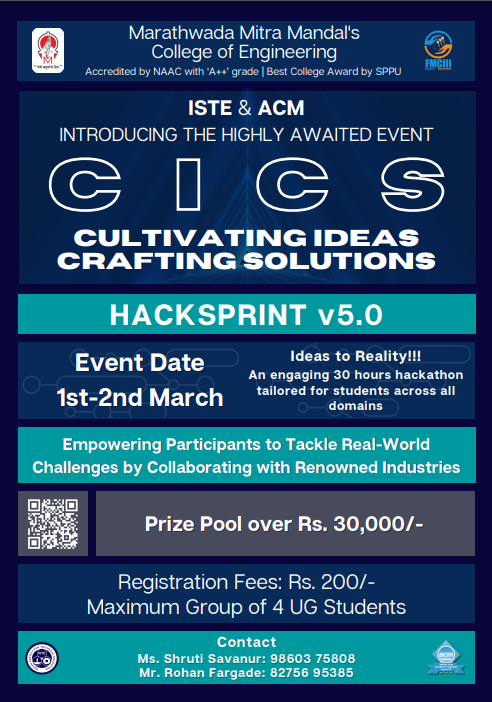

# Welcome to Hacksprintv5.o!

Hello participants! We're thrilled to have you on board for Hacksprintv5.o! This hackathon is an exciting opportunity for you to showcase your creativity and innovation. We can't wait to see the incredible projects you'll build.

## How to Add Your Project Link:

1. **Navigate to the [participant_project_links.md](https://github.com/Sam-1806/Hacksprintv5.o/blob/main/participant_project_links.md) file.**

2. **Edit the file:**
   - Click the pencil icon in the upper right corner to enter editing mode.

3. **Add your project link:**
   - In the file, add a new line with the following format:
     - `[Add Your Project link here](https://github.com/your-username/your-repository)`
   - Replace "Your Project Name" with the name of your project and the URL with the link to your GitHub repository.

4. **Commit Changes:**
   - Scroll down to the bottom of the page, provide a meaningful commit message (e.g., "Add [Your Project Name] link"), and select the option to commit directly to the `main` branch.

5. **Create a Pull Request:**
   - After committing the changes, GitHub will prompt you to create a pull request. Follow the instructions to create the pull request and submit your changes.

Feel free to reach out if you have any questions or need assistance. Join the Discord server for real-time support and collaboration. Happy hacking, and may your projects shine bright! 🚀

